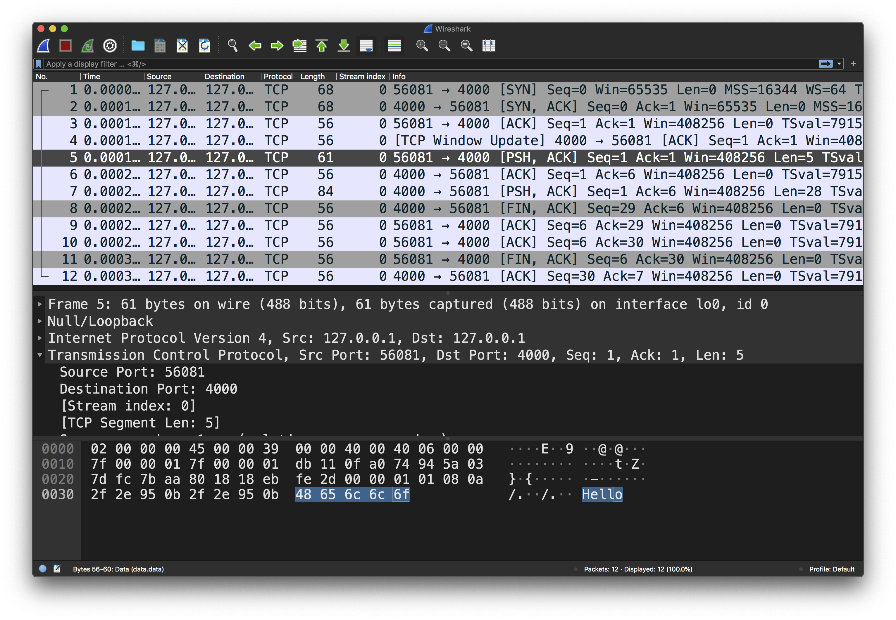

# Reading and writing data with Rust's TcpStream

For the start of our journey, let's look at what it takes to send and receive bytes with [TcpStream](https://doc.rust-lang.org/stable/std/net/struct.TcpStream.html).

This article is going to build up some concepts that result in a [demo found here](https://github.com/thepacketgeek/rust-tcpstream-demo/tree/master/raw). The working concept is that we want to have a client send some data (a String) to a server that will Echo the back to the client to print out. In further articles, we'll progress this concept to do slightly more interesting things with the data on the server.

# Writing
Let's start with our client and figuring out how to send some bytes (String characters) to our server.

`TcpStream`'s implementation of the [Write](https://doc.rust-lang.org/stable/std/io/trait.Write.html) trait gives us functionality to write data to the stream (allowing TCP to send bytes across the wire).

### write()
The [`write()`](https://doc.rust-lang.org/stable/std/io/trait.Write.html#tymethod.write) method takes a slice of bytes `&{u8]` and attempts to write them to the TcpStream (send them to the TCP buffer, without sending on the wire yet) and returns the number of bytes successfully written. If more bytes are written than can be buffered, `write()` will signal this with a usize less than the length of bytes sent.

After sending the bytes to the TCP buffer, use `flush()` to signal to TCP that it should send the bytes. This will set the PSH bit to signal this data should be sent to the application.

```rust
use std::io::{self, Write};
use std::net::TcpStream;

fn main() -> io::Result<()> {
    // Establish a TCP connection with the farend
    let mut stream = TcpStream::connect("127.0.0.1:4000")?;

    // Buffer the bytes
    let _bytes_written = stream.write(b"Hello")?;
    // Tell TCP to send the buffered data on the wire
    stream.flush()?;

    Ok(())
}
```

If you wanted to validate the `bytes_written` and somehow signal if not all the data could be written, an approach might look something like this:

```rust
...
    let data = b"Hello";
    let bytes_written = stream.write(data)?;

    if bytes_written < data.len() {
        return Err(io::Error::new(
            io::ErrorKind::Interrupted,
            format!("Sent {}/{} bytes", bytes_written, data.len()),
        ));
    }

    stream.flush()?;
...
```

### write_all()
It turns out that this is a common enough pattern to warrant a dedicated method: [`write_all()`](https://doc.rust-lang.org/stable/std/io/trait.Write.html#method.write_all). A simplified version of the example above becomes:

```rust
use std::io::{self, Write};
use std::net::TcpStream;

fn main() -> io::Result<()> {
    let mut stream = TcpStream::connect("127.0.0.1:4000")?;
    stream.write_all(b"Hello")?;
    stream.flush()
}
```

This is what the the TcpStream looks like in Wireshark. Notice the PSH bit set on the packet 5 (carrying the data segment "Hello"):



# Reading
Counterpart to the `Write` trait's `write()`/`write_all()`, the [Read](https://doc.rust-lang.org/stable/std/io/trait.Read.html) trait gives us the ability to read received bytes from a `TcpStream`. It's a bit more nuanced than `Write` and I'll show you why you'll tend to want to use the [BufRead](https://doc.rust-lang.org/stable/std/io/trait.BufRead.html) trait with [BufReader](https://doc.rust-lang.org/std/io/struct.BufReader.html)

### read()
The `read()` method takes a mutable reference `&mut` to a buffer (like a Vec<u8> or [u8]) and will attempt to it with received bytes. This would be easy if we knew that the messages received are always a fixed amount of bytes:

```rust
use std::io::{self, Read};
use std::net::TcpStream;

const MESSAGE_SIZE: usize = 5;

fn main() -> io::Result<()> {
    let mut stream = TcpStream::connect("127.0.0.1:4000")?;

    // Array with a fixed size
    let mut rx_bytes = [0u8; MESSAGE_SIZE];
    // Read from the current data in the TcpStream
    stream.read(&mut rx_bytes)?;

    let received = std::str::from_utf8(&rx_bytes).expect("valid utf8");
    eprintln!("{}", received);
    Ok(())
}
```

Since we live in a world with variable length strings, the approach above doesn't quite work out, but `read()` returns a `usize` of bytes_read, so we can get fancy reading to our statically sized array repeatedly until we have no more bytes to read:

```rust
...
    let mut stream = TcpStream::connect("127.0.0.1:4000")?;

    // Store all the bytes for our received String
    let mut received: Vec<u8> = vec![];

    // Array with a fixed size
    let mut rx_bytes = [0u8; MESSAGE_SIZE];
    loop {
        // Read from the current data in the TcpStream
        let bytes_read = stream.read(&mut rx_bytes)?;

        // However many bytes we read, extend the `received` string bytes
        received.extend_from_slice(&rx_bytes[..bytes_read]);

        // If we didn't fill the array
        // stop reading because there's no more data (we hope!)
        if bytes_read < MESSAGE_SIZE {
            break;
        }
    }

    String::from_utf8(received)
        .map(|msg| println!("{}", msg))
        .map_err(|_| {
            io::Error::new(
                io::ErrorKind::InvalidData,
                "Couldn't parse received string as utf8",
            )
        })
...
```

Alas, there are some issues with this code. The each time the `read()` call can be a syscall and we're also stuck with the decision of how to size the fixed length array:
- A large array (E.g. > 512 bytes) can waste stack space for bytes we may never read
- A small array results in more calls to `read()`, which can be expensive

Fortunately though, this is a common enough problem that there's a solution for us...

## BufRead and BufReader
The [BufRead](https://doc.rust-lang.org/stable/std/io/trait.BufRead.html) trait and [BufReader](https://doc.rust-lang.org/std/io/struct.BufReader.html) give us some really convenience read capabilities:

- `fill_buf()` and `consume()` - a tag team of methods I'll explain in this article
- `read_line()` (or the `Iterator` version: `lines()`) allow us to read by line (String ending with a newline)
  - *You can see this one in action to create a LinesCodec in the [next demo](../lines)*

### fill_buff() and consume()
Instead of repeatedly trying to fill an array with bytes, `BufRead` offers a `fill_buf()` method which returns a slice to all the bytes in the buffer, super convenient!

`fill_buf()` does not free/drop the bytes returned, and a subsequent call via `consume()` is necessary to tell the `BufReader` that the bytes were successfully read and it can move the internal cursor. This is helpful in the case where TCP may not have received all the data yet, and your code needs to check for a delimiter (*cough* like a newline *cough*):

```rust
use std::io::{self, BufRead};
use std::net::TcpStream;

fn main() -> io::Result<()> {
    let mut stream = TcpStream::connect("127.0.0.1:4000")?;
    
    // Wrap the stream in a BufReader, so we can use the BufRead methods
    let mut reader = io::BufReader::new(&mut stream);

    // Read current current data in the TcpStream
    let received: Vec<u8> = reader.fill_buf()?.to_vec();

    // Do some processing or validation to make sure the whole line is present?
    // ...

    // Mark the bytes read as consumed so the buffer will not return them in a subsequent read
    reader.consume(received.len());

    String::from_utf8(received)
        .map(|msg| println!("{}", msg))
        .map_err(|_| {
            io::Error::new(
                io::ErrorKind::InvalidData,
                "Couldn't parse received string as utf8",
            )
        })
}
```

# Conclusion

We've covered how to read and write bytes with `TcpStream`, but things could be easier for sure. The [next demo](../lines) will expand on the usage of `BufRead` to build a Lines Codec to abstract away the read/write detail in the client and server code.

# Running the demo
From within the 'raw' directory we can start the server, and then in another terminal (tmux pane, ssh session, etc), run the client with a message of your choice

Server
```
$ cargo run --bin server
Starting server on '127.0.0.1:4000'
...
```

Client
```
$ cargo run --bin client -- Hello
Hello
```
